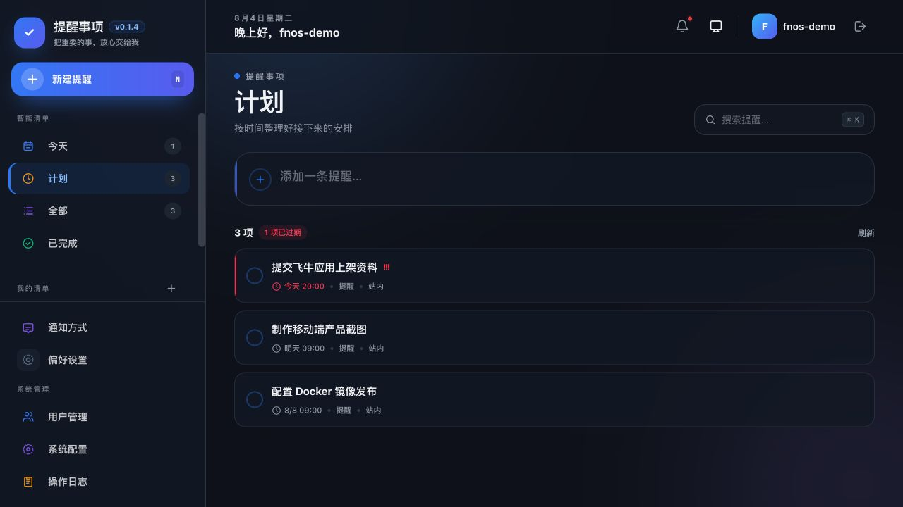
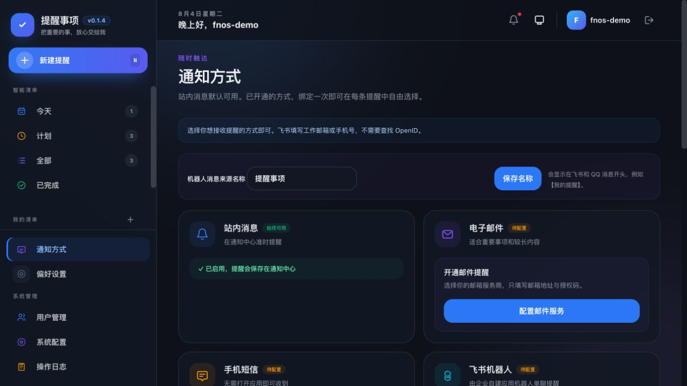
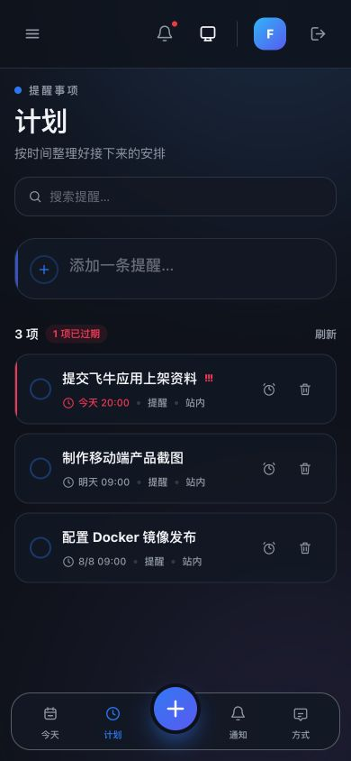
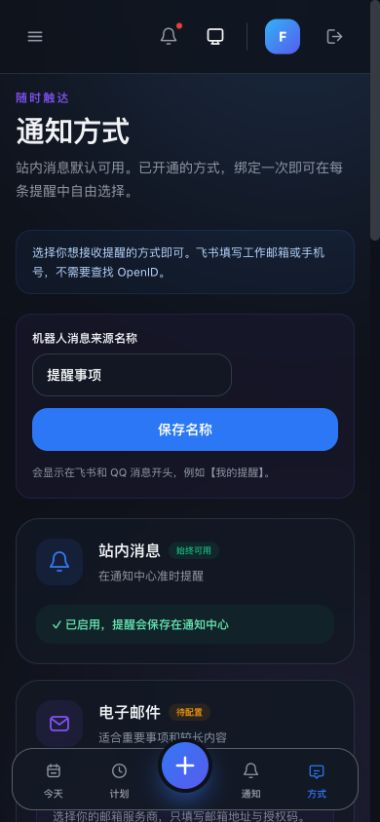

# reminders

Go + Vue 3 多渠道提醒中心，保留提醒清单和移动端风格，合并多种通知渠道并加入 Bark。
作者：steven。生产部署使用外部 MySQL 8 持久化。

版本功能与修复记录见 [CHANGELOG.md](./CHANGELOG.md)。

## Docker 部署（外部 MySQL 持久化）

```bash
docker compose up -d
docker compose ps
```

访问 `http://NAS或本机IP:8906`。MySQL 配置直接写在 `docker-compose.yml` 的 `environment` 中，
默认连接 `192.168.31.6:3306` 的 `reminders` 数据库和用户；请先在外部 MySQL 中创建数据库及用户。
应用首次启动会自动初始化 reminders 的表。

持久化目录：`./data` 保存日志和上传文件；提醒、用户、渠道配置持久化在外部 MySQL。
本项目只初始化自己的 reminders 数据库，不迁移或覆盖原有两个提醒应用的数据。
升级时执行 `docker compose pull && docker compose up -d`，不要删除 `./data`。

## 界面预览

| PC 端：计划视图 | PC 端：通知方式 |
| --- | --- |
|  |  |

| 手机端：计划视图 | 手机端：通知方式 |
| --- | --- |
|  |  |

## 技术栈

- Go + Gin + GORM + MySQL 8（生产）/ SQLite（单元测试回退）
- Vue 3 + TypeScript + Pinia + Vue Router
- Tailwind CSS + Vite

## 本地开发

要求 Go 1.26+、Node.js 20+、CGO 和本地 C 编译器。

```bash
# 构建 Vue 前端、复制到后端静态目录、构建并启动 Go 后端
make dev
```

浏览器访问 `http://localhost:8906`。开发模式只启动 Go 后端一个服务，API 和前端页面
共用 8906 端口；首次运行会自动安装前端依赖。可通过 `PORT=9000 make dev` 临时改端口。

本地开发默认使用 SQLite，运行 `make dev` 即可；邮件、短信、飞书和 QQ 等渠道可在应用的
“通知方式”页面配置。

仅构建或启动已构建产物：

```bash
make build
make start
```

首次注册的用户自动成为管理员。

## 核心能力

- 默认清单和自定义清单；
- 今天、计划、全部、已完成智能视图；
- 快捷新增、编辑、删除、完成、恢复；
- 一次性提醒使用原来的“日历选日期 + 时间”方式；
- 循环提醒使用易懂的 Cron 规则选择器，支持每天、每周、每月、每年、时间点、时间段和间隔；
- 时间段间隔先选单位再选数值，小时/分钟/秒的数值会按窗口严格限制，间隔必须小于窗口长度；
- 支持自定义 5/6 段 Cron 表达式，例如 `30 8-20/2 * * *`；
- 循环提醒可设置开始和结束边界，结束日期选择器会禁用开始时间之前的日期和时间；
- 一次性提醒不显示结束时间；
- 稍后 10 分钟提醒；
- 持久化投递任务、幂等领取、失败分类和最多三次重试；
- 站内通知中心；
- SMTP 邮件；
- 可配置短信 HTTP 网关；
- 飞书企业自建应用机器人单聊；
- QQ 机器人主动单聊；
- 钉钉个人群自定义机器人；
- 企业微信应用和群机器人 Webhook；
- 飞书 Webhook；
- PushPlus、Server 酱、Gotify、Ntfy、IYUU、巴法云；
- Bark（官方 `https://api.day.app` 或自建 Bark Server）；
- 浅色/深色主题和响应式手机界面。

## 页面绑定格式

在“通知方式”页面按卡片提示填写，所有接收目标会在 MySQL 中使用 AES-GCM 加密保存：

| 渠道 | 接收目标格式 |
|---|---|
| 企业微信应用 | `corpid|corpsecret|agentid|userid` |
| 企业微信/飞书/钉钉 Webhook | 粘贴对应官方 HTTPS Webhook |
| Gotify | `服务地址|应用 Token` |
| Ntfy | `服务地址|Topic|可选 Token` |
| 巴法云 | `UID|Topic`（按 ANotify 兼容格式，Topic 用于设备/分组标识） |
| Bark | `服务地址|Device Key|可选分组` |
| 其余 Token 渠道 | 直接填写 Token/SendKey |

Webhook 目标只接受对应官方域名，避免把提醒服务变成任意 URL 请求代理。

## 外部渠道配置

```text
# 邮件
SMTP_HOST
SMTP_PORT
SMTP_USERNAME
SMTP_PASSWORD
SMTP_FROM_NAME
SMTP_FROM_ADDRESS

# 短信 HTTP 网关
SMS_WEBHOOK_URL
SMS_WEBHOOK_TOKEN

# 飞书
FEISHU_APP_ID
FEISHU_APP_SECRET
FEISHU_BASE_URL

# QQ
QQ_BOT_APP_ID
QQ_BOT_APP_SECRET
QQ_BOT_API_BASE

# 可选：单独的数据加密密钥
REMINDER_DATA_KEY
```

渠道接收目标在数据库中使用 AES-GCM 加密。未设置 `REMINDER_DATA_KEY` 时，会从安装实例的
内部 JWT 密钥派生独立加密密钥。

## 在线统计

应用内置匿名使用统计能力（上报地址
`https://techfunway.wycto.cn/api/apps.online/refresh`）：

- **匿名透明**：每 60 分钟一次心跳，只上报设备级信息——哈希后的设备标识
  （`data/device.id`，卸载重装应用不变、重装系统才变）、操作系统、架构、部署形态
  与应用版本。不含用户名、主机名、提醒内容或 IP 明文。
- **可退出**：以下任一方式可完全关闭统计上报：
  - 启动参数 `-disable-stats`；
  - 环境变量 `DISABLE_STATS=1`；
  - 管理员在「系统配置」中关闭 `stats_enabled`（运行时生效）。

`DEVICE_TYPE`（`-device-type`）用于标识部署形态（`fnos`/`docker`），仅参与统计的平台
分布；`STATS_ENDPOINT` 环境变量可覆盖上报地址（本地测试用）。

### 钉钉个人提醒

无需创建钉钉应用，也无需配置服务器环境变量。请使用 Windows 或 Mac 的钉钉电脑端操作；手机端不能
创建或配置此机器人：

1. 新建一个专用提醒群，或打开一个现有群。
2. 如果不希望其他人看到提醒，请让群内只保留自己：可新建个人群，或将其他成员移出。
3. 打开群设置，进入“群机器人 / 机器人”，添加“自定义机器人”。
4. 安全设置选择“自定义关键词”，填写 `提醒`，复制 Webhook 地址。
5. 在应用的“通知方式 → 钉钉群机器人”粘贴 Webhook，并发送测试。

提醒会发送给该群的所有当前成员；群内只有你一人时，只有你能收到。每位用户的 Webhook 独立加密保存；
应用只接受钉钉官方机器人地址。

## 运行日志

运行日志默认仅写入 `<data-dir>/logs/`，按日期和级别分为 `info-YYYY-MM-DD.log`、
`warn-YYYY-MM-DD.log`、`error-YYYY-MM-DD.log` 与 `audit-YYYY-MM-DD.log`，默认保留 30 天。
这避免通知通道或后台任务的重复错误刷屏终端；需要排查时可直接查看对应文件。仅本地调试时可使用
`-log-console` 或 `LOG_CONSOLE=true` 同时输出到终端。

## 构建与测试

```bash
cd server && go test ./...
cd web && npm run build
make build
```

### 发布打包

```bash
# 仅编译并打包飞牛 fnOS：生成 x86、ARM 两份 .fpk，不构建 Docker 镜像
make package PACKAGE_TARGET=fnos

# 所有桌面/服务器平台压缩包
make package PACKAGE_TARGET=apps

# 仅构建本地 Docker 镜像（按需执行）
make package PACKAGE_TARGET=docker
```

`PACKAGE_TARGET=fnos` 会使用临时 Linux 编译容器生成 SQLite/CGO 二进制，但不会执行
`docker build`、不会创建镜像标签，也不会推送镜像。

完整产品与技术设计见 [docs/README.md](./docs/README.md)，接口见 [API.md](./API.md)。
